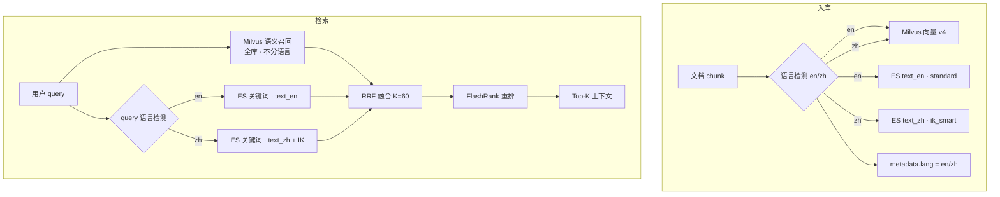
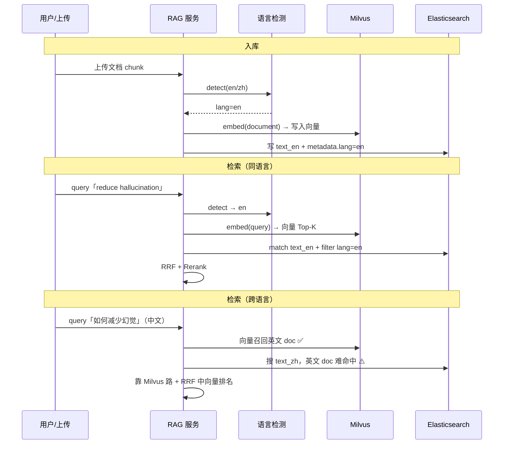
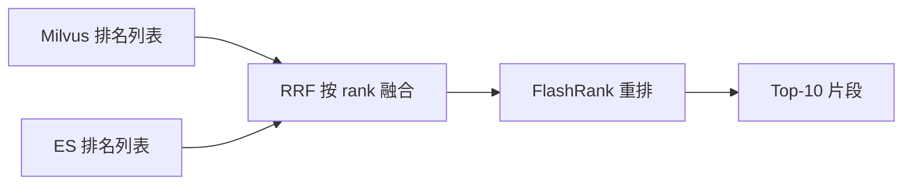

# Rag

> **业务背景（当前）**：知识库文档**要么纯英文、要么纯中文**（单篇不混用）；最终生成文章可以是英文或中文（由 LLM prompt 控制，与索引无关）。Embedding 用通义 **text-embedding-v4**（API）；双路召回：**Milvus 管语义/跨语言，ES 按语言分路管关键词**。

## 整体链路（对照项目）
文档上传 → 解析（PDF/MD/TXT/DOCX）→ **语言检测（en/zh）** → 切块（tiktoken 512/128）→ embedding（text-embedding-v4，`text_type=document`）→ 同时写入 **Milvus（向量，不分语言）** 和 **ES（全文，按语言分字段）** → 检索时检测 query 语言 + query 改写多路召回 → RRF 融合 → FlashRank 重排 → LangGraph 生成链路。

## 文档解析：PDF 三类处理（项目已实现）
`DocumentProcessor` 对 PDF 分三类处理，所有可选依赖都 try-import，缺失时优雅降级、不影响主流程：
1. **源文件 PDF（数字文本）**：`pypdf` 直接抽取文本层，最快最准。
2. **扫描件 PDF（图片型）**：当 pypdf 抽到的文本长度低于阈值（判定为扫描件）时，用 `pdf2image` 渲染成图片 + `pytesseract` OCR（英文 `lang=eng`）。OCR 需本机装 tesseract（Mac: `brew install tesseract`）和 poppler，没装就提示并跳过。
3. **带表格 PDF**：用 `pdfplumber` 抽取表格，转成 **Markdown 表格**追加到正文，保留行列结构，避免表格数据被拍平成乱序文本。

> 面试点：为什么要分三类——不同 PDF 的“文本可得性”不同，统一用 pypdf 会让扫描件抽出空文本、让表格丢结构；按类型路由能最大化信息保真度。

## 切块
### 一期（项目当前实现）
用 `RecursiveCharacterTextSplitter.from_tiktoken_encoder`，**按 token 数控制**，而不是固定字符数：

- `chunk_size=512`（token），`chunk_overlap=128`（token）
- 递归分隔符：段落 `\n\n` → 换行 `\n` → 句子 `. ? !` → 空格 → 字符
- 每个 chunk 写入 metadata：`doc_id`、`chunk_id`，便于后续溯源
- tiktoken 不可用时自动降级为按字符切，保证服务可启动

### 为什么是 512 / 128（面试重点）
- **为什么 512 token**：512 token 大约是一个完整自然段落的语义单元。太大（比如 1024+）会把多个不相关主题塞进一个 chunk，召回后噪声多、稀释相关性、还浪费上下文 token；太小（比如 128）会把一个完整论述切碎，召回到的片段缺上下文，模型容易断章取义。512 是“语义完整”和“检索精度”的折中，也是社区常用默认值。
- **为什么 128 overlap（约 25%）**：overlap 是为了解决切块边界把一句话/一个因果关系切断的问题。相邻 chunk 保留 128 token 重叠，能保证跨边界的信息在至少一个 chunk 里是完整的。25% 是经验上“防断裂”和“控制冗余存储”的平衡——再大就大量重复内容、浪费存储和召回名额。
- **为什么用 token 而不是字符**：LLM 的上下文和计费都按 token，按 token 控制能精确预估“塞进上下文的成本”，也避免中英文/标点导致字符数与 token 数偏差。

### 二期（已预留接口 `structure_aware_chunk`）
- 按标题、段落、Markdown 层级做结构化切块，而不是只按字符/token 切。
- metadata 记录 `doc_id`、`section_title`、`page_number`、`chunk_id`，方便答案溯源。
- 针对 SEO 文档按「标题、问题、解决方案、结论」做语义切块，提高生成时的上下文完整性。

## Embedding 维度为什么选 384（面试重点）
- 项目用 `BAAI/bge-small-en-v1.5`，输出 **384 维**，是模型结构（small 版隐藏层维度）决定的，不是随便设的。
- **维度的权衡**：维度越高（如 base=768、large=1024）通常表达能力更强、召回更准，但向量存储更大、检索更慢、内存更高；维度越低则更快更省，但语义区分度下降。
- 选 small/384 的理由：英文语义检索效果已经够用，向量库占用小、检索快、本地开发友好；后续若召回不够，可平滑升级到 bge-base-en（768）或 bge-m3，只需改配置 + 重建集合（维度变了必须重建 Milvus collection）。

## 如何 query 改写
### 项目实现
LangGraph 里有 `rewrite_query` 节点：把 `topic + keywords` 交给 LLM，生成 3-5 个英文检索 query，覆盖主题背景、用户痛点、解决方案、FAQ 等角度。每个 query 都走一遍双路召回。

### 去重（项目已实现）
改写结果会做**规范化去重**：统一转小写 + 去首尾空白后判重，避免“同义不同写法”的 query 重复检索、浪费召回名额；最多保留 5 个。

### 为什么要 query 改写
用户输入短、且表达方式和知识库不一致（用户说 “reduce AI making things up”，库里写 “hallucination / faithfulness”）。改写成多角度 query 能显著提升召回覆盖率（recall）。为了避免召回变多带来的噪声，后面用 RRF + rerank 收敛。

## 如何双路召回

### 总体架构（面试先讲这张图）



**一句话**：Milvus 负责**语义 + 跨语言**；ES 负责**同语言关键词**；RRF 融合后再 rerank。

---

### 业务前提

| 项 | 说明 |
| --- | --- |
| 文档语言 | 单篇**纯英文**或**纯中文**，不混排 |
| 生成语言 | 英文或中文均可，由 **LLM prompt** 决定，与 ES 无关 |
| 跨语言检索 | 中文 query 搜英文 doc（或反过来）→ **主要靠 Milvus + v4**，不靠 ES |
| 同语言检索 | 英文搜英文、中文搜中文 → **Milvus + ES 双路互补** |

---

### Milvus 向量路（不分语言）

- 模型：通义 **text-embedding-v4**（1024 维）；入库 `text_type=document`，检索 `text_type=query`。
- **中英文进同一向量空间**，支持语义相似、同义改写、跨语言对齐。
- 不按语言拆 collection；租户/系统级隔离仍用现有 `collection + tenant` 逻辑。

---

### ES 全文路（按语言分字段 · 推荐方案）

> **目标方案**（面试/生产推荐）：英文 **standard**，中文 **IK**；入库与检索都按语言路由。  
> **代码现状**：一期实现为 `text`（standard）+ `text.cjk`（内置 bigram），未装 IK；演进方向见下文。

#### 为什么不能「一个字段动态换分词器」

Elasticsearch 的 analyzer 在 **mapping 建索引时固定**，不能按「每条文档语言」在同字段上自动切换。  
正确做法：**分字段 + 应用层语言检测 + 查询路由**。

#### 索引 Mapping（目标设计）

```json
{
  "mappings": {
    "properties": {
      "text": { "type": "text", "index": false },
      "text_en": { "type": "text", "analyzer": "standard" },
      "text_zh": { "type": "text", "analyzer": "ik_smart" },
      "metadata": {
        "properties": {
          "lang": { "type": "keyword" }
        }
      }
    }
  }
}
```

| 字段 | 分析器 | 何时写入 |
| --- | --- | --- |
| `text_en` | `standard` | 检测到 **纯英文** 文档 |
| `text_zh` | `ik_smart`（需 IK 插件） | 检测到 **纯中文** 文档 |
| `metadata.lang` | `keyword` | 入库时写入 `en` 或 `zh`，便于过滤与排查 |

**入库逻辑（概念）**：

```python
lang = detect_language(text)  # en / zh，可人工覆盖
doc = {
    "text": text,
    "text_en": text if lang == "en" else "",
    "text_zh": text if lang == "zh" else "",
    "metadata": {..., "lang": lang},
}
```

#### 检索逻辑（概念）

```python
qlang = detect_language(query)
field = "text_en" if qlang == "en" else "text_zh"

# 只搜对应语言字段，避免两路 multi_match 带来噪声
es_query = {
    "bool": {
        "must": [{"match": {field: query}}],
        "filter": [{"term": {"metadata.lang": qlang}}]
    }
}
```

#### 入库 / 检索流程图



---

### IK 插件：要不要装？

| | **内置 cjk（代码现状）** | **IK（目标方案 · 中文路）** |
| --- | --- | --- |
| 作用 | CJK 双字 bigram 切分 | 中文词典分词（「机器学习」一词） |
| 安装 | ES 自带 | 需装 `analysis-ik` 或定制镜像 |
| 英文 | 靠 `standard` 子字段 | 同样靠 `text_en` + standard |
| 适用 | 快速 POC | **中文文档多、关键词检索重要** |

**结论**：文档语言单一且中文库要用 ES 关键词路 → **中文用 IK、英文用 standard 是 ES 侧最佳实践**；跨语言仍不依赖 IK。

---

### 什么方案 **不推荐** 作为主策略

#### ❌ ES 同义词打通中英文互搜

- 同义词只适合 **少量固定术语**（RAG↔检索增强、hallucination↔幻觉）。
- 开放域中英词对 **无法穷举**，维护成本极高。
- **跨语言语义**应交给 Milvus + v4；同义词最多作术语表 **锦上添花**。

#### ❌ 入库/检索都用 `multi_match` 同时打 text_en + text_zh

- 空字段、错误语言字段会引入噪声。
- 应 **检测语言 → 只搜对应字段**。

#### ❌ 指望 ES 单独完成「中文搜英文文档」

- BM25 是词面匹配，中英 token 不对齐。
- 可选增强：query 改写/翻译成英文后再搜 `text_en`（仍不如向量路自然）。

---

### 各场景谁负责（面试对照表）

| 场景 | Milvus | ES |
| --- | --- | --- |
| 英文 query → 英文 doc | ✅ 语义 | ✅ standard 关键词 |
| 中文 query → 中文 doc | ✅ 语义 | ✅ IK 关键词 |
| 中文 query → 英文 doc | ✅ **主路径** | ❌ 弱 |
| 英文 query → 中文 doc | ✅ **主路径** | ❌ 弱 |
| SKU / 错误码 / 品牌精确命中 | 一般 | ✅ **强项** |

---

### RRF 融合（项目已实现）

同一批 chunk 同时写入 Milvus 和 ES；检索时每个 query 走向量路 + 语言对应的 ES 路；跨 scope 时最多 **4 路** ranked list（租户 Milvus/ES + 系统 Milvus/ES）。

两路分数量纲不同（Milvus 余弦 vs ES BM25），**不能直接加权相加**。项目用 **RRF**：

- 公式：`score += 1 / (K + rank)`，项目中 **K=60**
- 只依赖排名，对量纲不敏感
- 融合后 **FlashRank MultiBERT** 重排，取 Top-10



---

### 面试 30 秒版（可直接背）

> 我们文档要么纯英要么纯中，双路召回：Milvus 用通义 v4 做语义和跨语言，中英文同一向量空间；ES 按语言分字段，英文 standard、中文 IK，入库和查询都做语言检测，只写/只搜对应字段，并用 metadata.lang 过滤。RRF 融合两路排名后再 rerank。跨语言不靠 ES 同义词，同义词只维护少量 SEO/AI 术语；中文搜英文靠向量路，必要时 query 改写成英文再搜 ES。

---

### 与生成语言的关系

| 环节 | 是否受「生成中/英文」影响 |
| --- | --- |
| 知识库 ES 怎么存 | ❌ 只看**源文档**语言 |
| Milvus 向量 | ❌ 不分语言 |
| 最终文章输出语言 | ✅ 仅 **LLM prompt / 模板** 控制 |

---

### 落地 Checklist（从现状演进到 IK 分路）

- [ ] Docker ES 安装 `analysis-ik` 插件（或换带 IK 的镜像）
- [ ] 上传链路增加 `detect_language()`，写入 `metadata.lang`
- [ ] Mapping 改为 `text_en` + `text_zh`，更新 `INDEX_PROFILE` 后缀
- [ ] 检索链路：检测 query 语言 → 路由 ES 字段 + 可选 lang filter
- [ ] 全量 re-index（mapping/analyzer 变更不可复用旧索引）
- [ ] （可选）少量业务同义词表，仅术语级，不替代向量跨语言

## 知识库
### 文档两级权限（项目已实现）
- **系统级（scope=system）**：写入共享集合（`tenant_id=__system__`），所有租户都能检索，适合通用 SEO 方法论、行业通用资料。
- **租户级（scope=tenant）**：写入各租户自己的集合，仅该租户可检索。
- **检索时的权限控制**：`RetrievalEngine` 只会查询「当前租户集合 + 系统级集合」，物理上不可能读到其他租户的数据；命中结果会标注 `access_scope`，便于溯源。
- 上传接口通过 `scope` 参数（system/tenant）区分。

### 知识库更新
SEO 方法论更新、企业产品文档升级时重新解析、切块、embedding 再入库，保证时效性；建议保留来源、版本、更新时间。

### Agent 结束后反哺知识库
文章优化/人工审核后，把「问题、原因、解决方案、采纳的证据」结构化入库，形成闭环，为之后相似主题提供经验。

## RAG 高频面试题（核心护城河）

### Q1：向量检索和全文检索分别擅长什么场景？为什么必须双路召回？
**回答思路：**
- **向量检索（Milvus）**：擅长**语义泛化**和**同义词**。比如用户搜“苹果手机”，能召回包含“iPhone”的文档。缺点是对专有名词、缩写、特定型号（如“BGE-M3”）不敏感，容易召回看似相关但核心实体错误的内容。
- **全文检索（ES）**：基于 BM25 算法，擅长**精准匹配**。用户搜特定的错误代码、专有名词、人名时，只要字面命中分数就高。缺点是缺乏语义理解，用户换个说法就搜不到。
- **结论**：单路都有盲区，双路互补能大幅提升召回上限（Recall）。

### Q2：你的双路召回是怎么做分数融合的？为什么不用简单的加权求和（如 0.7*向量 + 0.3*全文）？
**回答思路：**
- **痛点**：因为量纲不同。向量检索通常是余弦相似度（分数在 0~1 之间），而 ES 的 BM25 分数没有上限（可能几十甚至上百）。直接加权求和需要极其复杂的归一化调参，且换一批数据权重就失效了。
- **我的方案**：采用 **RRF（倒数排名融合，Reciprocal Rank Fusion）**。它完全抛弃了绝对分数，只看“排名”。公式是 `1 / (K + Rank)`（项目中 K=60）。
- **优势**：工程实现极简、鲁棒性极强、无需调参，是目前业界做多路召回融合的最优解。融合后再用 FlashRank（Cross-encoder）做一次精准重排，效果最好。

### Q3：你的 Chunk Size 是 512 token，如果答案需要跨越多个 Chunk 甚至多篇文档才能总结出来，怎么解决？
**回答思路：**
- **定性**：这是典型的多跳问答（Multi-hop QA）难题。
- **当前项目解法**：通过 `Query 改写`（生成 3-5 个不同角度的 query）来尽量把散落在不同地方的相关碎片都召回回来，然后把所有碎片喂给大模型，由大模型在生成阶段（`generate_article` 节点）做全局总结。
- **进阶解法（可作为后续优化讲）**：
  1. **父子块检索（Auto-merging Retriever）**：切块时切成小块（如 128 token）用于精准检索，但实际喂给大模型的是包含这个小块的“父块”（如 1024 token），提供完整上下文。
  2. **Graph RAG（知识图谱）**：在文档入库时，用 LLM 抽取出实体和关系构建图谱。检索时沿着图谱的边进行多跳游走。

### Q4：为什么要做 Query 改写？如果大模型改写出来的 Query 完全偏离了用户原意怎么办？
**回答思路：**
- **为什么做**：用户输入通常很短且口语化（如“怎么让 AI 不胡说”），和知识库的书面语（如“缓解大模型幻觉的策略”）不匹配。改写能扩充同义词和多角度，提升召回率。
- **防偏离对策**：
  1. **Prompt 强约束**：在改写 Prompt 中明确要求“必须保留核心 keywords，不可发散”。
  2. **保留原 Query**：把用户的原始 Query 也作为其中一路去检索，作为兜底。
  3. **去重与过滤**：对生成的 Query 做小写去重，限制最多 5 个，防止过度发散带来大量噪声。

### Q5：中英文知识库，ES 怎么配？要不要 IK？同义词能打通中英互搜吗？
**回答思路：**
- **业务**：文档要么纯英要么纯中；生成语言由 LLM 控制，与 ES 无关。
- **ES 最佳实践**：入库时语言检测 → 英文写 `text_en`（standard）、中文写 `text_zh`（ik_smart）；检索时检测 query 语言，只搜对应字段，并用 `metadata.lang` 过滤。
- **跨语言**：中文搜英文 doc 靠 **Milvus + text-embedding-v4**，不靠 ES；同义词只维护少量术语（RAG、hallucination 等），不能当主方案。
- **详见**：上文 [`如何双路召回`](#如何双路召回) 章节（含 Mermaid 架构图）。

### Q6：PDF 解析时，如果表格跨页了怎么处理？
**回答思路：**
- **当前项目解法**：目前一期使用 `pdfplumber` 按页抽取（`page.extract_tables()`），跨页的表格会被截断成两个独立的 Markdown 表格。
- **二期优化思路**：在内存中对比“上一页底部表格”和“下一页顶部表格”的表头（或者判断下一页顶部表格是否没有表头且列数一致）。如果一致，就在二维数组层面把它们拼接起来，最后再统一转成 Markdown 字符串。

### Q7：怎么评估你的 RAG 系统到底好不好？
**回答思路：**
- 我把评估分为两层，并在项目中通过 `eval/run_eval.py` 脚本落地：
- **第一层：检索质量（不依赖 LLM，便宜快速）**：构建离线测试集（Query - 标注关键词），计算 **Recall@K**（召回率，是否召回了相关内容）和 **Precision@K**（准确率，Top-K 里有多少是相关的）。同时对比 RRF 融合前后、重排前后的指标变化。
- **第二层：生成质量（依赖 Ragas 框架）**：使用 LLM-as-a-Judge 评估四个核心指标：
  - `Faithfulness`（忠实度：回答是否都在参考资料里，防幻觉）
  - `Answer Relevancy`（相关性：回答是否切题）
  - `Context Precision`（上下文精确度：有用的参考资料是否排在前面）
  - `Context Recall`（上下文召回率：参考资料是否足以回答问题）


# Agent
## LangChain
### 专有名词
待填写

### 如何做上下文管理设计
(小模型不能超过 2/3的 上下文 token 限制，LLM 不能超过 50K)

如大于模型最大上下文的一般，就可以考虑使用限流上下文。具体做法是

1.统一采用 tiktoken,类似的计算出上下文大小，预留 20%的误差。

2.假如计算出来的上下文大于 模型最大上下文的 2/3，那么就采用下面的限流策略

3.滑动窗口算法+RAG 摘要，舍弃一部分上下文。

3.1.使用 LangChain 框架的 ConversationSummaryBufferMemory 组件即可，利用滑动窗口算法+摘要即可实现上下文瘦身。具体做法是：

3.2配置两个大模型，主力模型负责执行主流程，摘要模型负责后台生成摘要。

3.3配置最近的数据不超过 50K，控制成本以及减少上下文噪声。

3.4框架会自动把近期的数据全部加载进来，然后控制 token 数量不超过 50K，然后再把历史的摘要加载进来

4.通过 Langchain 库的 ChatOpenAi(GPT，qianwen,deepseek) 和 ChatAnthropic(Claude) 这两个类，Gemini 是独特的 Grpc/Rest风格，但是可以通过兼容端点代理。

### LangChain 1.1有哪些新特性
1.0 是可用，1.1 是好用

+ 摘要中间件更好用
+ 有 model.dev,已经帮我们罗列好各种 LLM 的能力
+ 更好的管理上下文

## LangGraph
### 专有名词
+ State：全局共享数据（状态 + 数据流）
+ StateGraph / MessageGraph：定义工作流图（怎么搭建图）
+ Graph(搭建好的图)
+ Node：单步执行逻辑
+ Edge：节点连接关系
+ Conditional Edge：条件分支路由
+ START / END：起止节点
+ Reducer：状态字段合并策略
+ Chain / Runnable：节点内部可调用的能力单元
+ Checkpoint：会话状态持久化/恢复
+ Store：长期记忆或跨会话数据
+ Interrupt：人工介入中断点
+ Streaming：流式输出执行过程
+ Subgraph：可复用子流程

### 如何设计 LangGraph的图，节点，边以及状态管理
### 如何处理幂等操作？为什么要处理？
### 如何处理失败回退和降级策略？
### 断点续传如何处理
### 经典组件
1. **<font style="color:rgb(0, 0, 0);background-color:rgba(0, 0, 0, 0);">失败回退</font>**<font style="color:rgb(0, 0, 0);background-color:rgba(0, 0, 0, 0);">给节点绑定</font>`<font style="color:rgb(0, 0, 0);background-color:rgba(0, 0, 0, 0);">error_handler</font>`<font style="color:rgb(0, 0, 0);background-color:rgba(0, 0, 0, 0);">捕获执行异常，将异常信息写入图状态，通过</font>**<font style="color:rgb(0, 0, 0);background-color:rgba(0, 0, 0, 0);">条件边</font>**<font style="color:rgb(0, 0, 0);background-color:rgba(0, 0, 0, 0);">判断失败状态，自动跳转到预设的回退节点处理。</font>
2. **<font style="color:rgb(0, 0, 0);background-color:rgba(0, 0, 0, 0);">重试机制</font>**<font style="color:rgb(0, 0, 0);background-color:rgba(0, 0, 0, 0);">在状态中维护重试次数，节点异常时</font>`<font style="color:rgb(0, 0, 0);background-color:rgba(0, 0, 0, 0);">error_handler</font>`<font style="color:rgb(0, 0, 0);background-color:rgba(0, 0, 0, 0);">累加重试计数，通过条件边判断：未达最大次数则</font>**<font style="color:rgb(0, 0, 0);background-color:rgba(0, 0, 0, 0);">跳回当前节点重新执行</font>**<font style="color:rgb(0, 0, 0);background-color:rgba(0, 0, 0, 0);">，达到上限则进入回退 / 降级。</font>
3. **<font style="color:rgb(0, 0, 0);background-color:rgba(0, 0, 0, 0);">降级策略</font>**<font style="color:rgb(0, 0, 0);background-color:rgba(0, 0, 0, 0);">基于状态里的异常类型、失败次数做路由，失败后不走主逻辑，直接路由到</font>**<font style="color:rgb(0, 0, 0);background-color:rgba(0, 0, 0, 0);">轻量化、高可用的降级节点</font>**<font style="color:rgb(0, 0, 0);background-color:rgba(0, 0, 0, 0);">，执行简化兜底流程，保证流程不中断。</font>
4. **<font style="color:rgb(0, 0, 0);background-color:rgba(0, 0, 0, 0);">断点续传</font>**<font style="color:rgb(0, 0, 0);background-color:rgba(0, 0, 0, 0);">编译图时配置</font>`<font style="color:rgb(0, 0, 0);background-color:rgba(0, 0, 0, 0);">Checkpointer</font>`<font style="color:rgb(0, 0, 0);background-color:rgba(0, 0, 0, 0);">持久化检查点，</font>**<font style="color:rgb(0, 0, 0);background-color:rgba(0, 0, 0, 0);">每执行一个节点就持久化状态与执行进度</font>**<font style="color:rgb(0, 0, 0);background-color:rgba(0, 0, 0, 0);">；服务崩溃或中断后，从最新检查点恢复，从失败的节点继续执行，实现断点续跑。</font>

一句话：

<font style="color:rgb(0, 0, 0);background-color:rgba(0, 0, 0, 0);">LangGraph 通过</font>**<font style="color:rgb(0, 0, 0);background-color:rgba(0, 0, 0, 0);">异常捕获 + 状态驱动 + 条件路由</font>**<font style="color:rgb(0, 0, 0);background-color:rgba(0, 0, 0, 0);">实现失败、重试、降级，通过</font>**<font style="color:rgb(0, 0, 0);background-color:rgba(0, 0, 0, 0);">检查点持久化</font>**<font style="color:rgb(0, 0, 0);background-color:rgba(0, 0, 0, 0);">实现断点续传，全程工作流可观测、可恢复、可降级。</font>

### 项目落地（对照 `DAG/workflow.py`，面试可直接讲）
项目里的生成链路本身就是一个 DAG：`rewrite_query → retrieve_rag → search_serp → generate_titles →(中断:选标题)→ generate_outlines →(中断:选大纲)→ generate_article → quality_check → END`。

- **持久化 / 断点续传**：编译图时挂 `SqliteSaver`（落盘 `checkpoints.sqlite`），按 `thread_id` 存每步状态；进程重启后能从最新检查点继续。SQLite 不可用时降级为 `MemorySaver`，保证可启动。
- **人机交互中断**：`interrupt_before=["generate_outlines","generate_article"]`，生成标题/大纲后暂停，等前端写回用户选择（`update_state`）再 `invoke(None)` 续跑——这就是三段式生成的实现方式。
- **重试 / 降级（节点级）**：
  - 检索：单个 query 召回失败就跳过该 query（不阻断整体）；rerank 失败则降级为“按 RRF 融合分直接取 Top-K，不重排”。
  - 外部搜索：SerpAPI 失败 → `serp_results=[]`，降级为仅用知识库。
  - 质量评估：LLM 返回非法 JSON / 异常 → 返回带原因的兜底报告，而不是整条流程报错。
- **LLM 降级**：所有节点的模型调用走 `LLMService`，自带多 provider 降级 + 重试（见“技术选型 / 大模型”）。
- **可观测**：每次运行挂 Langfuse callback（云端，可选），自动上报 prompt/模型/token/耗时/调用链。

### DAG / LangGraph 高频面试题（贴 `DAG/workflow.py`）

#### Q1：这条流程用普通函数顺序调用也能跑，为什么非要上 LangGraph？
**标准答案**：因为我需要三个普通脚本给不了的能力，而 LangGraph 原生支持：
1. **状态持久化（Checkpoint）**：每个节点执行完自动落盘，进程崩了能从断点续跑，不用从头重跑（重跑 = 重新烧钱调 LLM）。
2. **人机交互中断（Interrupt）**：我的业务是「标题→大纲→正文」三段式，中间要等用户选，普通函数做不到“执行到一半挂起、等外部输入再继续”。
3. **统一的状态流转 + 可观测**：所有节点共享一个 `State`，配合 Langfuse 能把整条链路串成一条 trace。
> **一句话**：流程简单确实不用 LangGraph，但只要涉及「持久化 + 人工介入 + 可观测」，它能省掉一大堆自己造的轮子。

#### Q2：你的 State 怎么设计的？节点之间是怎么传数据的？
**标准答案**：用 `TypedDict` 定义 `SEOState`，关键是加了 `total=False`——表示**所有字段都可选**，每个节点只需返回它负责更新的那部分字段，LangGraph 自动 merge 进全局 State，不用每个节点都把整个 State 传一遍。
- 比如 `_rewrite_query` 只 `return {"rewritten_queries": [...]}`，`_retrieve_rag` 只 `return {"rag_docs": [...]}`。
- 好处：节点解耦、职责单一，新增节点不影响别人。
**加分点**：默认是“覆盖式”合并；如果某字段需要“追加式”合并（多节点往同一个 list 里加），可以给字段配 **Reducer**（如 `Annotated[list, add]`）。

#### Q3：断点续跑（持久化）具体怎么实现的？
**标准答案**：编译图时传 `checkpointer`，我用 `SqliteSaver` 把 checkpoint 落到 `checkpoints.sqlite`。运行时靠 `config={"configurable": {"thread_id": xxx}}` 区分会话——同一个 `thread_id` 就是同一条流程的状态线。
- 每执行完一个节点，状态 + 进度就持久化一次；服务重启后用同一个 `thread_id` 调用，就能从最近的 checkpoint 继续，而不是从头跑。
- **降级**：`SqliteSaver` 不可用时我 catch 住、退回 `MemorySaver`（内存级），保证服务至少能启动。
**加分点**：thread_id 我直接复用业务的会话 ID，这样持久化粒度和业务天然对齐。

#### Q4：三段式生成的“暂停等用户选”是怎么做的？（Human-in-the-loop）
**标准答案**：编译图时设 `interrupt_before=["generate_outlines", "generate_article"]`，图执行到这两个节点**之前会自动挂起**。
- `start()`：跑到生成标题后停住，返回 5 个标题给前端。
- 用户选完，`choose_title()` 用 `graph.update_state()` 把 `selected_title` 写回 State，再 `graph.invoke(None, config)`（传 None 表示“不给新输入，从断点继续”）→ 生成大纲后又停。
- `choose_outline()` 同理写回大纲、续跑 → 生成正文 + 质检 → END。
> **为什么不一把生成**：标题/大纲是“岔路口”，让用户在便宜的早期环节把方向定准，避免直接生成一篇千字文却跑偏，**省钱又可控**。

#### Q5：某个节点失败了，整条流程会不会崩？你的降级策略是什么？
**标准答案**：我做的是**节点级降级**，核心原则是“单点失败不拖垮全局，能兜底就兜底”：
- **检索**：多个改写 query 逐个召回，**单个 query 失败就 `continue` 跳过**，不影响其他 query。
- **重排**：rerank 抛异常 → 降级为“不重排，直接按 RRF 融合分取 Top-K”。
- **联网搜索**：SerpAPI 失败 → `serp_results=[]`，降级为**只用知识库**生成。
- **质检**：LLM 返回非法 JSON / 异常 → 返回带原因的**兜底质量报告**，而不是让整条流程报错。
- **LLM 调用**：所有节点走 `LLMService`，自带多 provider 降级（DeepSeek→千问→豆包）+ 重试。
> **一句话**：每个节点都问自己“我挂了，下游还能不能拿到一个能用的结果？”

#### Q6：节点重复执行 / 重试会不会出问题？幂等怎么考虑？
**标准答案**：要分两种节点看：
- **检索类节点**（rewrite/retrieve/serp）天然接近幂等，重跑顶多结果略有波动，无副作用，可以放心重试。
- **生成类节点**（调 LLM）**不是幂等的**——同样输入也可能给不同输出，且每次都花钱。所以我不在节点内部盲目重试整段，而是：① 把 LLM 的重试收敛到 `LLMService` 里做有限次；② 靠 checkpoint 保证“已经成功的节点不会被重复执行”，续跑时是从失败点之后开始，而不是把前面成功的节点再跑一遍。
**加分点**：如果未来节点要写库（如反哺知识库），我会用业务唯一键做幂等去重，防止重试导致重复写入。

#### Q7：怎么监控这条 DAG 的运行进度和状态？
**标准答案**：两个层面：
- **状态查询**：任意时刻用 `graph.get_state(config).values` 拿到当前 State，知道跑到哪、各字段值是什么（前端就是靠这个拿标题/大纲/结果）。
- **全链路 trace**：每次运行挂 Langfuse callback，按 `thread_id` 把每个节点的 prompt/模型/token/耗时/失败点串成一条 trace，线上能直接看“哪个节点慢、哪个节点贵、哪个节点走了降级”。

#### Q8（进阶钩子）：现在质检 `quality_check` 只打分，分数低了能自动重写吗？
**标准答案**：当前一期是**线性 DAG**，质检只产出分数 + 风险 + 建议，不自动回炉（控制成本、避免死循环）。
**演进方向**：把 `quality_check` 后面从固定边改成**条件边（Conditional Edge）**——分数低于阈值就路由回 `generate_article` 重写，并在 State 里维护重试计数，超过上限就停下来交人工。这其实就是往「Reviewer Agent 闭环」演进的第一步（属于二期多 Agent 规划）。

## DAG 实现方式-一期
### 业界常用的 RAG + Agent 工程化方案（简洁版）
#### 1) 数据与知识库层（Knowledge Pipeline）
+ Ingest/ETL：文档采集（产品文档/FAQ/竞品/政策）→ 清洗去重 → 版本化（source、时间戳、hash）。
+ Chunking & Metadata：按标题层级+语义切块；打上 product/feature/version/lang/audience 等元数据。
+ 双索引：ES（稀疏）+ Milvus（稠密）；写入时做质量校验（空块、重复块、过长块）。
+ 离线评测集：沉淀一批真实 query + 标注答案/证据，作为回归基线。

#### 2) 在线检索层（Retrieval Service）
+ Query Agent（查询理解）：意图分类 + 实体抽取 + query rewrite（生成多 query）。
+ Hybrid Retrieval：ES + Milvus 双路召回 → 归一化融合（RRF/加权）→ TopK。
+ Rerank：Cross-Encoder/LLM rerank → TopN 证据切片。
+ Citation Gate：强制回答必须引用证据切片（无证据则降级为“需要补充资料/建议入库”）。

#### 3) 生成与工作流层（Agentic Workflow）
+ 生成文章工作流，使用 LangChain自带的工作流
+ 优化文章工作流，使用 LangGraph，比较复杂。

#### 4) 质量与可观测（Evaluation & Observability）
+ Langfuse：全链路 tracing（prompt/模型/检索命中/延迟/成本/失败原因）+ prompt 版本管理。
+ Ragas：离线/在线抽样评测（faithfulness、context precision/recall 等）→ 形成质量看板。
+ 自动回归：每次改 prompt/检索参数/模型路由，都跑评测集对比基线，防止“改崩”。

#### 5) 成本与稳定性（Production Hardening）
+ Model Router：按复杂度/风险路由模型（便宜模型优先，关键步骤再用强模型）。
+ 语义缓存：相似 query 命中缓存，降本提速。
+ 降级策略：检索失败→改写 query→扩大召回→仍失败则返回“需补资料”并自动生成入库任务。

## 多 Agent实现方式-二期
待实现，基于一期，主要是一组 Agent 一起并发实现优化文章。其中会遇到的挑战。


## 父子 Agent实现方式-三期
待实现，基于二期，多 Agent 共同处理任务的时候，某个 Agent 还能继续拆分子 agent

# 优化 & 监控
## 如何提升召回率
+ 语义切块+overLap
+ 双路召回
+ query 改写
+ 降低余弦量的值

## 如何提升精准度
+ 语义切块+overlap
+ 双路召回
+ query 改写
+ 定义合理的余弦量最低值，以及双路召回权重


## 如何降低 AI 使用的成本
## 如何做语义缓存
## 如何提升文章的忠实度？
## 如何提升文章的相关性？
## 如何减少大模型幻觉
## 如何更好得写提示词
## 如何监控 Agent 工作流的进度和状态
# 技术选型

> 前提：小公司、**没有私有化部署预算**，全部走 **API 调用**。所以选型核心是“效果够用 + 成本可控 + 可随时切换/降级”，而不是“自己部署一套”。

## 大模型如何选型
### 项目做法
统一封装三家国产大模型，**全部走 OpenAI 兼容接口**，调用方式完全一致（`LLMService`）：
- DeepSeek（默认主力，性价比高）
- 通义千问 Qianwen
- 豆包 Doubao（火山方舟，注意填推理接入点 ID）

切换只需改 `DEFAULT_LLM_PROVIDER`，其余代码不动。

### 失败降级 + 重试（项目已实现）
- 主 provider 调用失败 → 按 `FALLBACK_PROVIDERS` 顺序自动切换到备用模型。
- 单个 provider 内对偶发错误（限流/网络）重试 `LLM_MAX_RETRIES` 次。
- 这样既能按成本路由（便宜模型优先），又保证某家服务抖动时整体不挂。

### 选型逻辑（面试怎么说）
1. **为什么 API 不私有化**：私有化要 GPU、运维、模型迭代跟不上，小公司不划算；API 按量付费、随时用最新模型。
2. **为什么统一 OpenAI 兼容接口**：屏蔽厂商差异，方便 A/B、灰度、按成本/质量路由，避免被单一厂商锁定。
3. **怎么按场景路由**：简单步骤（query 改写、质量打分）用便宜模型；正文生成等关键步骤用更强模型。
4. **稳定性**：多 provider 降级 + 重试 + （可加）语义缓存。

## Embedding 如何选型

> **完整对比文档**（OpenAI vs 通义/智谱/百度/豆包 vs 开源 BGE）：见 [`Document/Embedding选型对比.md`](Embedding选型对比.md)

### 项目做法（当前实现）
用通义 **`text-embedding-v4`**（1024 维 dense），走 **DashScope API**（与千问共用 `QIANWEN_API_KEY`）；入库 `text_type=document`，检索 `text_type=query`（非对称检索）。重排用多语言 cross-encoder `ms-marco-MultiBERT-L-12`（FlashRank）。**ES 按语言分路（英文 standard / 中文 IK）详见上文 [`如何双路召回`](#如何双路召回)**；代码现状仍为 standard+cjk，IK 为演进目标。Milvus 集合后缀 `INDEX_PROFILE=v4`。

> 演进：纯英文 `bge-small-en-v1.5` → 本地 `bge-m3` → 当前 **text-embedding-v4 API**（模拟生产：全 API 化，免本地模型下载）。

### 快速对比结论（面试 30 秒版）

| 场景 | 推荐 | 不推荐 |
| --- | --- | --- |
| 纯英文 SEO | OpenAI `text-embedding-3-small` | 纯中文模型 |
| 纯英文、要最高精度 | OpenAI `text-embedding-3-large` | 3-small（精度不够时） |
| 中英混合（本项目） | 通义 `text-embedding-v4`（1024 维） | `3-large`（中文非最优）、`bge-small-en` |
| 中文为主 | 通义 v4、Cohere embed-v4 | OpenAI large（中文非最优） |
| 零 API 费、有 GPU | 自托管 `bge-m3` | 强行走 API |
| 生成用豆包 | embedding 仍可用通义 v4 或 3-large | 不必强行同厂商 |

> `text-embedding-3-large` 专项对比见 [`Embedding选型对比.md` §3.1.1](Embedding选型对比.md)。

### 选型逻辑（面试怎么说）
1. **Embedding 与 LLM 解耦**：检索通义 v4 + 生成豆包/千问/DeepSeek，完全合理。
2. **为什么不用 OpenAI embedding**：我们是中英混合 + 国内全 API，通义 v4 中文更好、与千问同 Key、无海外网络依赖。
3. **为什么不用本地 bge-m3**：小公司生产通常不买 GPU 跑 embedding；本项目用 v4 API **模拟生产形态**。
4. **评估再定**：用自建 query-doc 集测 Recall@K，别只看 MTEB；换模型必须 re-index。
5. **Rerank 不能省**：双路召回 + RRF 后对候选集做 cross-encoder 重排。

## Java 和 Python 如何选型
### 项目做法（职责划分）
- **Java（Spring Boot 网关）**：对外 API 网关、租户管理、鉴权、业务编排、转发请求给 Python；集成 SpringDoc Swagger。
- **Python（FastAPI）**：AI / RAG / LangGraph 工作流、文档解析、embedding、检索、生成；集成 FastAPI 自带 Swagger。

### 选型逻辑（面试怎么说）
1. **Python 做 AI**：LangChain/LangGraph/sentence-transformers/pymilvus/ragas 等 AI 生态都在 Python，AI 能力首选 Python。
2. **Java 做网关/业务**：企业已有 Java 体系、Spring 生态成熟，做鉴权、多租户、事务、对接内部系统更稳。
3. **怎么协作**：Java 网关统一入口和权限，把 AI 相关请求转发给 Python 服务；两边各自出 Swagger 便于联调。
4. **好处**：AI 迭代和业务系统解耦，各用各自最擅长的生态，互不拖累。
# AI 编程
面试官会问我，如何用 AI 编程提升效率，我现在主要用 CUrsor,Trae

需要设计，如何用 AI 提升效率，涉及软件开发全流程。举个例子我能想到的就是，产品发布 PRD，然后 AI 能够读取到 PRD（比如通过 MCP 接口），然后拉取分支，开始干活，编写单元测试以及测试用例，然后用户体验验收，然后压测，最终交付上线。可能要涉及到 AI 如何控制整个软件生命周期，以及不让 AI 瞎写导致出问题。

#  面试常见追问（标准答案）
### Q1：你怎么评估“文章优化”是不是有效？
我分两层：

+ **离线质量**：Ragas（faithfulness/context precision等）+ SEO Rubric（覆盖度/结构/重复率）
+ **线上效果**：GSC（CTR/排名/展现/点击）+ 观察窗口对比基线，必要时做灰度/分组

### Q2：怎么避免 Agent 胡改、改崩文章？
三道闸：

+ **Plan 约束**：优先 Small Patch，限制改动比例/是否允许改标题
+ **Verifier Gate**：Ragas + 结构化 rubric + Diff Safety（敏感结论必须引用）
+ **可回滚**：版本化与灰度，指标恶化自动回滚并复盘

### Q3：为什么一定要多 Agent？单 Agent 也能写啊
多 Agent 解决的是“生产系统的可控性”：

+ 诊断/规划/执行/验证拆开，每步可观测、可替换、可并行
+ 失败可定位（是检索、结构、证据还是内链），并自动选择下一步
+ 真正做到闭环迭代与回归，而不是一次性生成

### Q4: 可观测（Observable）是什么意思
系统上线后，你能看得清楚它每一步在做什么、为什么这样做、哪里慢/贵/错了。

+ 例子：一次生成里，检索召回了哪些切片、rerank 排序结果、用了哪个模型、花了多少 token、最终答案引用了哪些证据、失败点在哪（超时/命中差/评测不通过）。
+ 你这里的落地：用 Langfuse 做 tracing、日志、成本与延迟看板、prompt/参数版本记录。

### Q5: 可回归（Regression-testable / Reproducible）是什么意思
你改了 prompt、检索参数、模型、分块策略后，能稳定复现并验证：质量有没有变好/变差，而不是“凭感觉”。

+ 例子：每次改动都跑一套固定评测集（历史关键词、QA 样本），对比改动前后的 faithfulness/相关性/命中率/成本，不达标就不发布或回滚。
+ 你这里的落地：用 Ragas + 自定义 rubric 做自动评测，并绑定到版本（prompt/检索参数/模型路由）。

### Q6: 可降级（Degradable / Graceful fallback）是什么意思
当某个环节出问题（检索失败、模型超时、成本超预算、外部工具不可用），系统不会“直接挂掉”，而是自动切换到更稳的备选路径，保证可用性。

+ 例子：
+ 向量检索不可用 → 先用 ES 关键词检索顶上
+ rerank 超时 → 退化为不 rerank 或降低 topK
+ GPT‑4 超预算 → 路由到更便宜模型 + 缓存命中优先
+ 证据不足 → 返回“需要补充资料/触发入库任务”，而不是编造
+ 你这里的落地：Model Router、语义缓存、分级超时/重试、无证据不输出等策略。

一句话总结：

+ 可观测让你“定位问题快”；可回归让你“改系统不翻车”；可降级让你“线上稳定不崩”。

# 知识
## 专有名词
| 名词 | 一句话核心定义 | 面试考点 |
| --- | --- | --- |
| **LLM** | 大语言模型，Agent 的 “大脑”，负责理解、推理、生成文本 | 模型选型、上下文窗口、幻觉、推理能力 |
| **Agent** | 具备规划、记忆、工具调用、反思能力的自主智能体 | 核心能力、工作流程、与普通 LLM 的区别 |
| **A2A** | 多智能体之间分工协作、任务流转的架构模式 | 多智能体优势、任务拆分、协同机制 |
| **MCP** | 模型与工具之间标准化调用协议，基于 JSON-RPC | 工具调用规范、与 Function Calling 区别 |
| **ACP** | 智能体与智能体之间的通信协议 | 与 MCP 的区别、A2A 协作底层支撑 |
| **Skill** | 可复用、标准化的原子能力单元，类似 AI 插件 | 与工具区别、技能编排、生态化 |
| **OpenClaw** | AI 本地执行平台，负责操作系统级真实落地操作 | 架构定位、与 Agent/Skill/MCP 的关系 |
| **RAG** | 检索外部知识再生成，解决幻觉与知识过时 | 流程、向量库、分块、重排序、优缺点 |
| **CoT** | 思维链，让模型分步推理再给出答案 | 提升推理、复杂任务、Prompt 写法 |
| **ReAct** | 思考 → 行动 → 观察 → 再思考，Agent 标准范式 | Agent 执行流程、工具调用循环 |
| **Tool Use** | 模型调用外部工具 / API / 数据库 / 文件等能力 | 函数调用、参数构造、异常处理 |
| **Reflection** | 执行后自检、评估、纠错、重试的能力 | 提升可靠性、减少错误、自我优化 |
| **Memory** | Agent 的短期上下文记忆与长期向量记忆 | 记忆类型、存储方式、RAG 结合 |
| **Embedding** | 文本转为向量，用于语义检索与相似度匹配 | 向量库、RAG、长期记忆实现 |
| **Orchestration** | 多 Agent / 多工具 / 多步骤的流程编排与调度 | 任务管理、状态同步、异常恢复 |
| **Vector DB** | 存储向量、支持高效语义检索的数据库 | RAG 必备、常见选型、检索流程 |
| **Hallucination** | 模型编造虚假信息、事实错误 | 产生原因、如何缓解（RAG / 反思 / 校验） |
| **Prompt** | 给 LLM 的指令，决定行为与输出格式 | 工程技巧、Few-shot、结构化输出 |
| **Token** | LLM 处理文本的最小计算单位 | 上下文长度、成本限制、截断问题 |
| **Planning** | 将复杂任务自动拆解为多步可执行子任务 | Agent 核心能力、任务拆解逻辑 |


## MCP
## ACP
## Agent
### Harness
这个很重要，是所有 Agent 框架的底层架构，属于 AI 的控制系统。用于回答如何控制 AI 更好得工作。

## A2A
## Skill
### 是什么
一类似 Cursor rule，我们可以编写，然后不用每次都和 AI 说。是一种结构化的，可复用的能力。

### 在哪里可以下载
Anthropic 官网，github 等地方

### 怎么用 
以对应的格式，写好skill，然后每次调用 API 的时候传递过去，或者云端上传，本地 1 每次传递一个 assistId 即可

## OpenClaw
## Hermes(爱马仕)


# 重点（面试引导剧本）

> **两层结构**
> - `# Rag` / `# Agent` / `# 技术选型` = **弹药库**（被深挖时有细节可讲）
> - 本节 = **剧本**（我主动抛亮点和主线，把面试官引到我准备最透的地方）
>
> **当前范围**：一期 **RAG + DAG**，不含多 Agent（二期）。

---

## 这个重点到底在回答什么？

| 维度 | 内容 |
|------|------|
| **面试主问题** | 如何解决 AI 幻觉、提升英文 SEO 文章生成质量？ |
| **技术主线** | RAG 找证据 → grounding 约束生成 → quality_check 质检 → Langfuse/Ragas 可观测与回归 |
| **项目定位** | 面向英文 SEO 的**多租户 RAG + LangGraph 可控生成**，不是「接向量库就出一篇文章」 |

**一句话记住**：防幻觉是**目标**，四道防线是**手段**，RAG + DAG 是**载体**。

---

## 先背这三段（开场用）

### ① 30 秒项目介绍
> 我做的是一套**面向英文 SEO 的多租户 RAG 生成系统**。核心不是堆模型，而是解决四件事：**证据找得对不对、生成能不能溯源、质量能不能评估、改动会不会改崩**。  
> 知识库分**系统级共享 + 租户级隔离**；生成用 **LangGraph 三段式**（标题→大纲→正文），中间人工定方向；正文强制 `[KBx]`/`[WEBx]` 引用，前端可核对；生成后有 **quality_check** 打分，全程 **Langfuse** 可追踪。

### ② 3 个差异化亮点（面试官最容易记住）
1. **可证明的忠实度**：grounding 规则 + 结构化 citations + `citation_coverage` 打分，证据来自系统库还是租户库可标注——**能演示、能核对**。
2. **多租户知识隔离**：检索只查「本租户 + 系统级」，`tenant_002` 搜不到 `tenant_001` 私有文档——**B2B / 出海营销真实场景**。
3. **可控生成链路（RAG + DAG）**：LangGraph 编排全链路，**interrupt 人机选标题/大纲**、**checkpoint 断点续跑**、**节点级降级**——不是一次性调 API 出全文。

### ③ 一句话主线（抛钩子）
> “我把它拆成 **RAG 检索增强 + 四道防线**：**① 召回与精排**（证据找全排准）→ **② grounding**（只能照证据说并标注引用）→ **③ quality_check**（生成后评估忠实度/引用覆盖）→ **④ Langfuse + 离线评测**（可观测、可回归，改 prompt 不翻车）。”

**留钩子（停顿等面试官接话）**：
> “检索、grounding、质检和 Langfuse 我都接到主流程里了。您想从**检索、防幻觉、LangGraph 工作流**，还是**评测监控**哪块往下聊？”

---

## 引导提问表（他问我往哪引）

| 面试官可能问 | 引到哪里 | 一句话钩子 |
|-------------|----------|-----------|
| 怎么提升召回率/精准度？ | `# Rag`、**RAG 高频题 Q1/Q2** | 双路互补 + RRF，不是简单加权 |
| 切块 / embedding 怎么选型？ | `# Rag / 切块`、`# 技术选型` | 512/128 token、bge-small-en 384 维 |
| 多租户 / 权限怎么做？ | `多租户与文档权限说明.md` | 系统级 + 租户级，只查两个 scope |
| 怎么防幻觉 / 怎么证明没编？ | 防线②③ + 前端 citations 演示 | 强制引用 + 引用覆盖打分 |
| 知识库没更新怎么办？ | SerpAPI 节点 + KB/WEB 融合 | 私有知识 + 实时联网互补 |
| 为什么用 LangGraph？ | **DAG 高频题 Q1/Q4** | interrupt 人机协同 + checkpoint |
| 节点挂了怎么办？ | **DAG 高频题 Q5**、追问 Q6 | 单 query 跳过、rerank/SERP/LLM 降级 |
| 怎么评估 RAG？ | **RAG 高频题 Q6**、防线④ | recall@k + Ragas 四指标 |
| 怎么监控 / 怎么回归？ | 追问 Q4/Q5、Langfuse | push 上云 + 固定评测集对比基线 |

---

## 落地边界（被追问时用，显得诚实）

| 能力 | 状态 |
|------|------|
| 双路召回、RRF、rerank、query 改写、两级权限 | ✅ 已接主流程 |
| grounding 规则、citations 返回前端 | ✅ 已接主流程 |
| `quality_check` 质量报告 | ✅ 已接主流程（一期：报告 + 人工决策，**不自动回炉**） |
| Langfuse 全链路 trace | ✅ 已接（配置在 `DAG/config.py`） |
| `eval/run_eval.py` + Ragas | ✅ 离线回归脚本（改参数前先跑） |
| 质检不达标自动重写 | 🔜 二期（条件边 + 重试上限） |

---

## 四道防线（展开话术）

### 防线① 检索质量——证据找得全、排得准
**为什么先做检索**：幻觉的第一来源往往是证据不到位——没召回就瞎编，排序差就被噪声带偏。

**项目做法**：
- **召回**：tiktoken 切块 + 25% overlap → query 改写 3-5 条（去重）→ Milvus 向量 + ES 全文双路召回。
- **精排**：RRF 融合（量纲不同不能简单加权）→ FlashRank 重排 → Top-10。
- **干净**：只检索「当前租户 + 系统级」，避免越权和无关噪声。

**追问往哪引**：RRF → **RAG Q2**；512/128 → **`# Rag / 切块`**；召回不全 → **RAG Q3**（父子块 / GraphRAG 作二期思路）。

---

### 防线② grounding——模型只能照着证据说
**项目做法**：
- Prompt 写死：优先 `knowledgeBase`，再用 `web_info`；事实句末标 `[KBx]`/`[WEBx]`。
- **没检索到**：不许编内部事实，显式说明资料不足。
- **证据与先验冲突**：以检索证据为准，冲突记入质量报告风险项。
- 返回结构化 **citations**，前端展示来源与 scope（系统级/租户级）。

**追问往哪引**：假引用 → 防线③ `citation_coverage` + Ragas Faithfulness；时效性 → **SerpAPI** 补 WEB 证据。

---

### 防线③ 质量闸——生成完再评估
**项目做法**：
- DAG 末节点 `quality_check`：LLM-as-a-Judge 打 **faithfulness / relevance / structure / citation_coverage**，输出风险与建议。
- 英文文章模版作 system 指令，约束 SEO 结构。
- **一期**：出报告，人工决定是否重试；**不声称**已自动打回重写。

**追问往哪引**：Judge 不准 → **Ragas 离线评测**作客观回归；生成跑偏 → **interrupt 选标题/大纲** + grounding。

---

### 防线④ 可观测 + 可回归——看得见、改不坏
**项目做法**：
- **Langfuse**：按 `thread_id` 串 prompt / 模型 / token / 耗时 / 命中证据 / 降级路径（push 模式，本地可上报云端）。
- **离线评测**：`eval/dataset.json` 固定 query + 标注；`run_eval.py` 跑 recall@k / precision@k / 重排增益；`--with-ragas` 跑生成质量。**改 prompt / 检索参数 / 模型前先对比基线。**

**追问往哪引**：监控指标 → **追问 Q4**；防改崩 → **追问 Q5**；线上故障 → **追问 Q6** + DAG 节点降级。

---

## 2 分钟现场演示（可选，印象分高）

1. **租户隔离**：`tenant_001` 上传租户级文档 A；`system` 上传共享文档 B → `tenant_002` 只能搜到 B，搜不到 A。
2. **可溯源**：走完生成三步 → 看引用表里的 `[KBx]`、scope、质量分里的 **citation_coverage**。
3. **可追踪**：Langfuse 里打开同一条 `thread_id` trace，指给面试官看检索→生成各节点耗时。

---

## 收尾话术
> “总结就是：**先靠 RAG 把证据找全排准，再用 grounding 和引用把生成锁住，生成后用 quality_check 评估，最后用 Langfuse 和离线评测保证持续迭代不翻车**。您想从哪块继续深聊？”

---

## 如何解决 AI 幻觉问题，提升文章生成质量（详细展开）

> 上面是**精简背诵版**；下面是同一主线的**展开版**。内容一致，面试前以「先背三段 + 引导表」为主，被追问再翻本节细节。

### 第 0 步：与「一句话主线」相同（见上 §③）
四道防线钩子：**召回精排 / grounding / 质量闸 / 可观测回归**——面试官任挑其一，下面均有对应展开。

---

### 防线①：检索质量——证据找得全、排得准（钩子：召回率 / 精准度）
**主线话术**：幻觉的第一来源是“证据不到位”。证据没召回，模型只能瞎编；证据排序差，噪声进了上下文也会带偏。所以我先把检索做扎实：
- **召回（recall）**：tiktoken 语义切块 + 25% overlap 防边界截断 → query 改写成 3-5 个多角度 query（去重）→ Milvus 向量 + ES 全文**双路召回**互补。
- **精排（precision）**：多路结果用 **RRF 融合**（对分数量纲不敏感）→ FlashRank cross-encoder 重排 → 取 Top-10 高相关证据。
- **干净**：两级权限只检索“当前租户 + 系统级”，杜绝越权/无关数据污染上下文。

**埋的钩子 → 被追问时往哪引**：
- 问“双路为什么不直接加权求和？” → 引到 **RAG 高频题 Q2（RRF）**，讲量纲问题 + `1/(K+rank)` + K=60 经验值。
- 问“切块 512/128 怎么定的？” → 引到 **`# Rag / 切块`**，讲语义完整 vs 检索精度的折中。
- 问“召回还是不全怎么办？” → 引到 **RAG 高频题 Q3（多跳）**，抛父子块检索 / GraphRAG，显示纵深。

---

### 防线②：强制证据引用 grounding（钩子：模型凭什么不编）
**主线话术**：证据齐了，还要逼模型“只能照着证据说”。我在生成 prompt 里写死了 grounding 规则：
- 优先用 `knowledgeBase`，再用 `web_info`；事实/数据/定义/方案**必须在句末标注来源** `[KB1]`/`[WEB2]`。
- **没检索到**（knowledgeBase 为 none）：明确不许编内部事实，只能用 web 或一般性表述，并显式说明“资料不足”——宁可不说，也不编。
- **证据和模型先验冲突**：以检索证据为准（RAG 的前提就是外部知识优先），冲突点丢给质量闸当风险项暴露。
- 工作流把 `citations`（KB/WEB 来源）结构化返回前端，可点开核对。

**埋的钩子 → 被追问时往哪引**：
- 问“怎么保证它真的引用了，而不是假装引用？” → 引到防线③的 `citation_coverage` 打分 + Q6 的 Faithfulness 指标。
- 问“实时性问题怎么解决（知识库没更新）？” → 引到 **SerpAPI 联网节点**，讲 KB + WEB 融合 + 溯源标签。

---

### 防线③：质量闸——生成完再评估（钩子：LLM-as-a-Judge / Ragas）
**主线话术**：生成不是终点，我在 DAG 里加了 `quality_check` 节点做**生成后质检**：
- 用 LLM-as-a-Judge 打 4 个分：**faithfulness（忠实度）、relevance（相关性）、structure（结构）、citation_coverage（引用覆盖）**，并产出风险项 + 改进建议。
- 英文文章模版作为 system 指令，约束结构与写作规则，从源头保证格式质量。
- **当前一期**：先产出质量报告 + 风险项，供人工决策是否重试；**不自动回炉**（二期可用条件边 + 重试上限）。

**埋的钩子 → 被追问时往哪引**：
- 问“LLM 打分不准 / 自己夸自己怎么办？” → 引到 **Ragas 离线评测**（用独立框架 + 标注集做客观回归），讲 Q6 四指标。
- 问“怎么防止生成跑偏？” → 引到 **grounding + 人工选标题/大纲（interrupt）+ quality_check**，讲可控生成而非一次性出全文。

---

### 防线④：可观测 + 可回归——改动不翻车（钩子：Langfuse / 离线评测）
**主线话术**：上线后还要能“看得见、改得动、不翻车”：
- **可观测（Langfuse）**：每次生成的 prompt / 模型 / token / 花费 / 各节点耗时 / 命中证据 / 失败点 / 是否降级，按 `thread_id` 串成一条 trace。Langfuse 是 **push 模式**，本地主动推到云端，本地项目也能上报。
- **可回归（Ragas + 离线评测集）**：`eval/dataset.json` 沉淀固定 query + 标注，`eval/run_eval.py` 跑 recall@k / precision@k / 重排增益（不花钱），`--with-ragas` 再跑 faithfulness 等生成质量指标。**每次改 prompt/参数/模型都先跑评测对比基线。**

**埋的钩子 → 被追问时往哪引**：
- 问“可观测具体监控啥指标？” → 引到 **面试常见追问 Q4（可观测）**。
- 问“怎么保证改 prompt 不把效果改崩？” → 引到 **Q5（可回归）**，讲版本绑定 + 评测集回归。
- 问“线上某个环节挂了怎么办？” → 引到 **Q6（可降级）** + DAG 的节点级降级（rerank 失败不重排、SERP 失败仅用 KB、LLM 多 provider 降级）。

---

### 收尾（与上文「收尾话术」相同，任选其一背）
> “整体就是：**检索找全证据 → grounding 约束生成 → 质量闸评估 → 可观测 + 回归保证不翻车**。您想从哪块往下深聊？”

**作用**：选项全在我准备的圈里——检索、防幻觉、LangGraph、评测监控，任选一个都能讲透。

## 多Agent 设计（二期规划）
> 面试官如果问“为什么一期用 DAG，二期要用多 Agent？”，回答：DAG 适合**步骤固定、流程确定**的任务（如三段式生成）；多 Agent 适合**开放性、需要反复推敲**的任务（如“帮我把这篇文章优化到能排 Google 首页”），需要 Agent 自己规划、调用工具、反思修改。

+ **如何定义每个 Agent 的边界和能力**
  - **Planner Agent**：负责分析用户意图，拆解任务（如：先查竞品，再查关键词，再改写）。
  - **Researcher Agent**：专门负责调用 RAG 和 SerpAPI 查资料，总结成报告。
  - **Writer Agent**：专职写作，只负责把报告转化为符合 SEO 格式的文章。
  - **Reviewer Agent**：充当“裁判”，用 Ragas 指标或自定义 Rubric 打分，如果不达标就打回给 Writer 重写。
+ **如何限制 Agent 不乱改**
  - 给 Writer Agent 设定严格的 System Prompt（如：必须保留原意、必须引用 `[KB]`）。
  - Reviewer Agent 作为**硬性门控（Gatekeeper）**，如果检测到幻觉或未引用证据，直接拦截输出。
  - 引入 Human-in-the-loop（LangGraph 的 `interrupt`），关键修改必须人点确认。
+ **如何做到可观测、可回归、可降级**
  - **可观测**：每个 Agent 的思考过程（Thought）和工具调用（Action）都作为独立 Span 上报 Langfuse。
  - **可回归**：沉淀 100 篇历史文章作为评测集，每次改版 Agent 逻辑，都跑一遍对比 CTR/SEO 评分。
  - **可降级**：如果 Researcher Agent 查不到资料，降级为“要求用户补充”，而不是让 Writer Agent 瞎编。
+ **如何监控每个 Agent 的运行状态和执行质量**
  - 在 Langfuse 中给不同 Agent 打上不同的 `tags`（如 `role:researcher`）。
  - 监控核心指标：Reviewer Agent 的**打回率**（如果太高说明 Writer 有问题或任务太难）、每个 Agent 的 token 消耗占比。
+ **Agent 组最终融合的时候，如何保证质量的？**
  - 采用 **Supervisor（主管）架构** 或 **StateGraph 状态机**。所有 Agent 不直接对话，而是把结果写回全局 State。
  - 最终输出前，必须经过一个专门的 `Output_Formatter_Node` 清洗格式，并由 Supervisor 做最后一次兜底校验。


