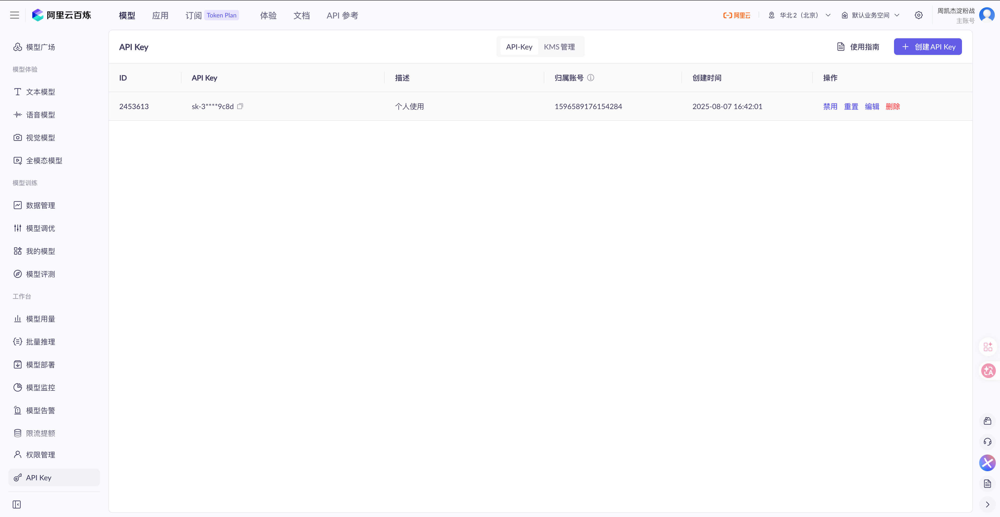
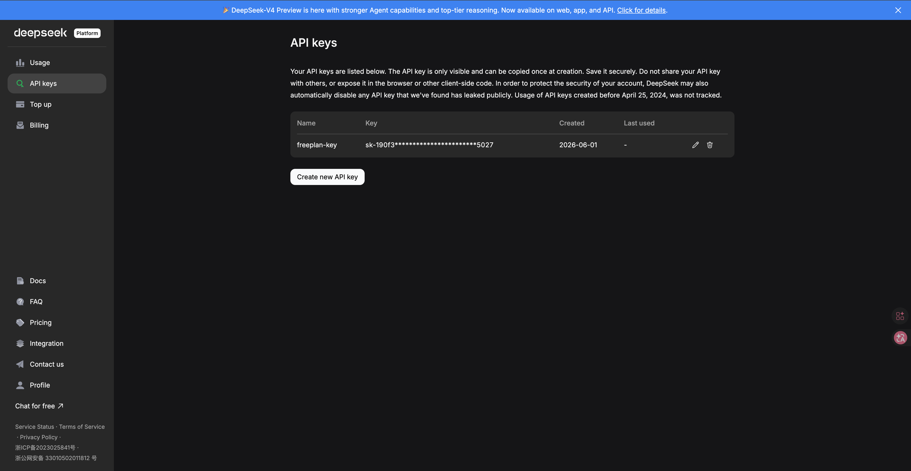
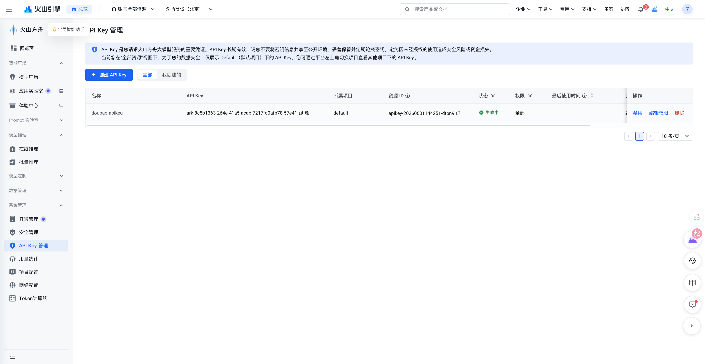
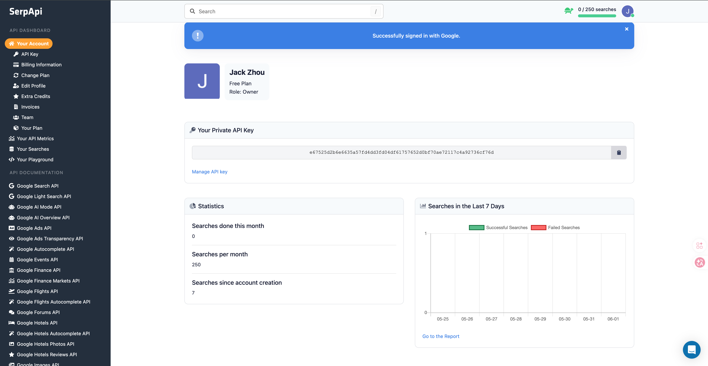

# Qianwen
API Key:sk-3d87ca46e5904d5db7af196073d29c8d

# DeepSeek
API Key:sk-190f3e034cef42609e94c18179fc5027

# Doubao Lite
API Key:ark-8c5b1363-264e-41a5-acab-7217fd0afb78-57e41

# Serp API
API Key:e67525d2b6e6635a57fd4dd3fd04df61757652d0bf70ae72117c4a92736cf76d

# Milvus
- Host: localhost
- Port: 19530
- Embedding Dimension: 512
- 默认集合: default
- 说明: 本地 Docker 运行，无需用户名密码

# PostgreSQL
- Host: localhost
- Port: 5432
- Database: example_db
- Username: admin
- Password: password

# Elasticsearch
- Host: localhost
- Port: 9200
- 说明: 本地 Docker 运行，无认证